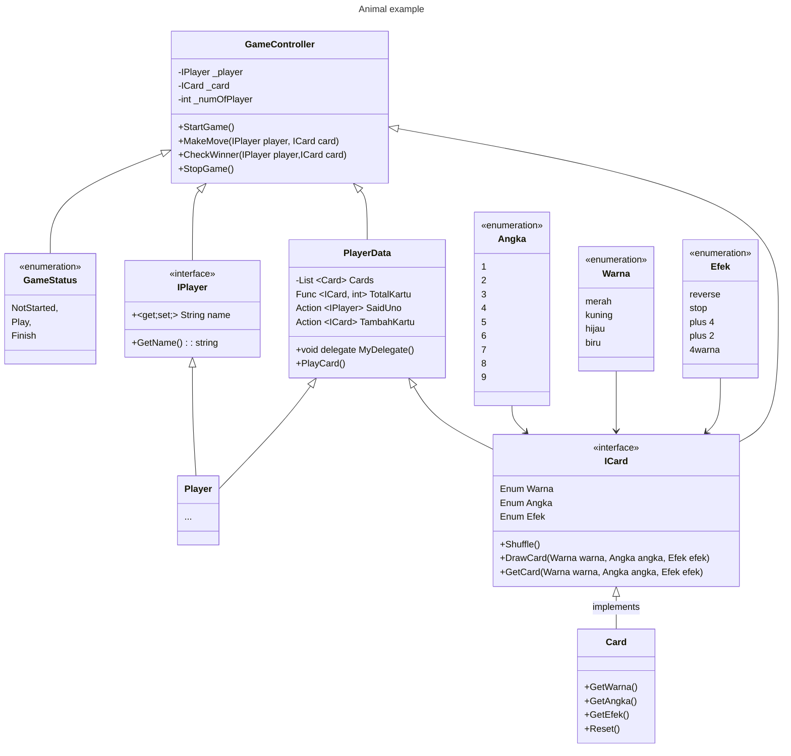

```mermaid
---
title: Animal example
---
classDiagram
    GameController <|-- ICard
    GameController <|-- PlayerData
    GameController <|-- IPlayer
    GameController <|-- GameStatus
    IPlayer <|-- Player
    PlayerData <|-- ICard 
    ICard <|-- Card : implements
   

    PlayerData <|-- Player


    Angka  --> ICard
    Warna  --> ICard
    Efek  --> ICard

    class GameController{
        -IPlayer _player
        -ICard _card
        -int _numOfPlayer
        +StartGame()
        +MakeMove(IPlayer player, ICard card)
        +CheckWinner(IPlayer player,ICard card)
        +StopGame()
        
    }
    class IPlayer{
    <<interface>>
        +~get;set;~ String name
        +GetName() : string
    }
    class Player{
    ...
    }
    class PlayerData{
        -List ~Card~ Cards
        +void delegate MyDelegate()
        Func ~ICard, int~ TotalKartu 
        +PlayCard()
        Action ~IPlayer~ SaidUno
        Action ~ICard~ TambahKartu
    }

    class ICard {
    <<interface>>
        %% -+~get;set;~ int number
        %% -+~get;set;~ string warna GetSet
        %% -<get;set>
        Enum Warna
        Enum Angka
        Enum Efek
        +Shuffle()
        +DrawCard(Warna warna, Angka angka, Efek efek)
        +GetCard(Warna warna, Angka angka, Efek efek)   
    }
    
    
    class Card{
        +GetWarna()
        +GetAngka()
        +GetEfek()
        +Reset()
    }
    class  Warna{
    <<enumeration>>
        merah
        kuning
        hijau 
        biru
    }
    class  Angka{
    <<enumeration>>
        1
        2
        3
        4
        5
        6
        7
        8
        9
    }
    class  Efek{
    <<enumeration>>
        reverse
        stop
        plus 4
        plus 2
        4warna
    }
    class  GameStatus{
    <<enumeration>>
        NotStarted,
        Play,
        Finish
    }
    


```