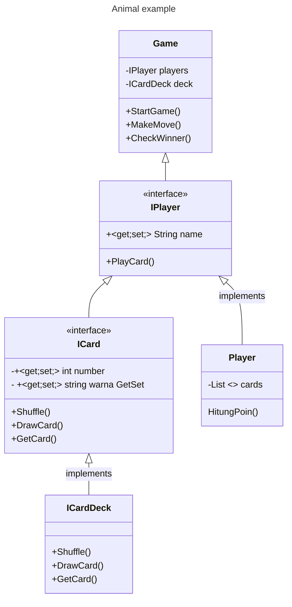

```mermaid
---
title: Animal example
---
classDiagram

    Game <|-- IPlayer
    
    %% Card <|-- Player
    IPlayer <|-- ICard
   
   ICard <|-- ICardDeck : implements
    %% ICardDeck <|-- CardDeck : implements

    %% Player <|-- IPlayer : implements
    IPlayer <|-- Player: implements

    
    Game : -IPlayer players  
    Game : -ICardDeck deck
    Game : +StartGame()
    Game : +MakeMove()
    Game : +CheckWinner()

    class ICard {
    <<interface>>
     -+~get;set;~ int number
        - +~get;set;~ string warna GetSet
        +Shuffle()
        +DrawCard()
        +GetCard()
       
    }
    

    class ICardDeck{
   
        +Shuffle()
        +DrawCard()
        +GetCard()
    }


    %% class Player{
    %%     +String name GetSet
    %%     -List<Card> cards


    %% }

    class IPlayer{
    <<interface>>
        +~get;set;~ String name 
       
        +PlayCard()
    }
    
    class Player{
        -List <<Card>> cards
        HitungPoin()
    }


```