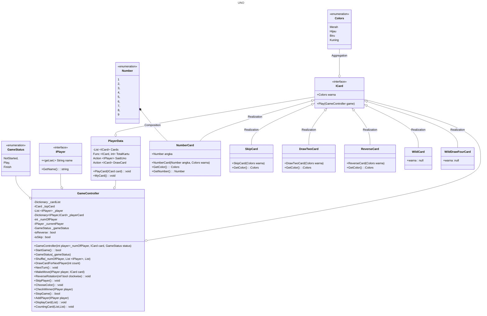

```mermaid
---
title: UNO
---
classDiagram
    ICard --o GameController 
    PlayerData --o GameController
    IPlayer --o GameController
    GameStatus --o GameController
  

    ICard --o PlayerData 
    ICard <|-- NumberCard : Realization
    ICard <|-- SkipCard : Realization
    ICard <|-- DrawTwoCard : Realization
    ICard <|-- ReverseCard : Realization
    ICard <|-- WildCard : Realization
    ICard <|-- WildDrawFourCard : Realization


    
    Number *-- NumberCard : Composition
    Colors --o ICard : Aggregation


    class GameController{
        -Dictionary <List ICard> _cardList
        -ICard _topCard
        -List ~IPlayer~ _player
        -Dictionary~IPlayer,ICard~_playerCard
        -int _numOfPlayer
        -IPlayer _currentPlayer 
        -GameStatus _gameStatus
        -isReverse : bool
        -isSkip : bool
        +GameController(int player=_numOfPlayer, ICard card, GameStatus status)
        +StartGame() : bool
        +GameStatus(_gameStatus)
        +Shuffle(_numOfPlayer, List ~IPlayer~, List<ICard>)
        +DrawCardForNextPlayer(int count)
        +NextTurn():void
        +MakeMove(IPlayer player, ICard card) 
        +ReverseRotation(ref bool clockwise) :void
        +SkipPlayer() :void
        +ChooseColor():void
        +CheckWinner(IPlayer player)
        +StopGame():bool
        +AddPlayer(IPlayer player)
        +DisplayCard(List<IPlayer>):void
        +CountingCard(List<IPlayer>,List<ICard>):void
        
        
    }

    class IPlayer{
    <<interface>>
        +~get;set;~ String name
        +GetName() : string
    }

   
    
    class PlayerData{
        -List ~ICard~ Cards
        Func ~ICard, int~ TotalKartu 
        Action ~IPlayer~ SaidUno
        Action ~ICard~ DrawCard
        +PlayCard(ICard card):void
        +MyCard():void
        
    }
    class Colors{
        <<enumeration>>
        Merah
        Hijau
        Biru
        Kuning
    }

    class ICard {
    <<interface>>
        %% -+~get;set;~ int number
        %% -+~get;set;~ string warna 
        +Colors warna
        +Play(GameController game)
    }

    class Number{
        <<enumeration>>
        1
        2,
        3,
        4,
        5,
        6,
        7,
        8,
        9
    }

    class NumberCard{
        +Number angka
        +NumberCard (Number angka, Colors warna)
        +GetColor(): Colors
        +GetNumber(): Number
        
    }

    class SkipCard{
        +SkipCard(Colors warna)
        +GetColor():Colors
    }
    class DrawTwoCard{
        +DrawTwoCard(Colors warna)
        +GetColor():Colors
        
    }
    class ReverseCard{
        +ReverseCard(Colors warna)
        +GetColor():Colors
    }
    class WildCard{
        +warna : null
    }
    class WildDrawFourCard{
        +warna :null
    }
    
    
   
    class  GameStatus{
    <<enumeration>>
        NotStarted,
        Play,
        Finish
    }
    


```